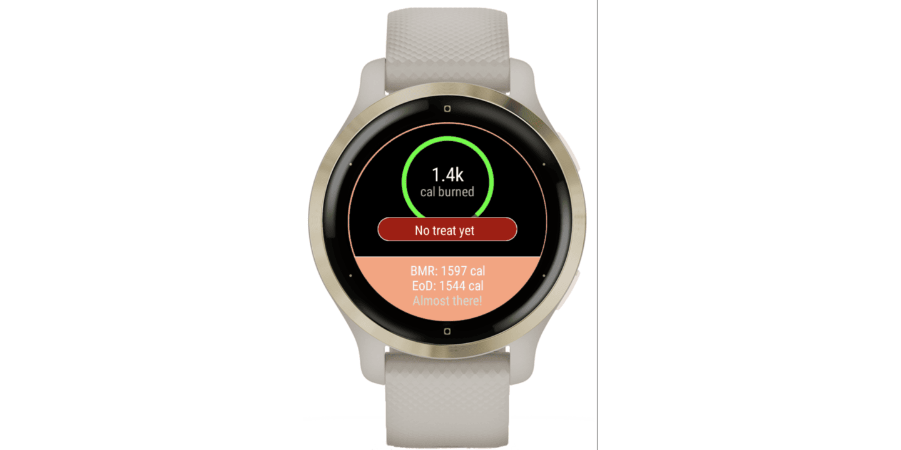

# 🍷 Treat Yourself ~

> A Garmin watch widget to help you manage your caloric intake. 🍷



Treat Yourself is a lightweight Garmin watch widget designed to help you manage your daily caloric intake effectively.
By tracking your physical activity and providing personalized valuations. Treat Yourself gives you quick insights into your calorie consumption and expenditure.

> It also gives you a daily treat based on your activity level!

Get yourself the app at the [Connect IQ Store](https://apps.garmin.com/apps/31d07127-3b03-4ff4-bea9-15d297efeacf).

## Tested Devices

- Venu 2
- Venu 2 Plus
- Venu 2s

## Requirements

- Install the [Garmin Connect IQ SDK](https://developer.garmin.com/connect-iq/overview/)
- Install the Monkey C extension for Visual Studio Code
- A Garmin device that supports Connect IQ apps

## Build the IQ file

```sh
$ monkeyc -o out/TreatYourself.iq -f monkey.jungle -d venu2s --release -y /Users/$USER/Documents/developer_key -e
```
